# Long-Form Audio Cutting for ALM Pretraining

Use the long-form audio pretraining pipeline to turn diarized, transcribed recordings into bounded-duration snippets for audio language model (ALM) pretraining. The pipeline preserves speaker and transcript metadata, shifts timestamps into each snippet's time range, converts audio to mono, resamples it, and packages the results as a sorted tar archive plus JSONL manifest.

This workflow is different from the [ALM windowing tutorial](/curate-audio/tutorials/alm). The windowing pipeline selects metadata windows from an existing manifest. This pipeline also reads source audio, extracts the selected ranges, and produces reusable audio assets for interleaved audio/text continuation, ASR, TTS, or diarization training.

## Pipeline flow

```mermaid
flowchart LR
    A["Long-form JSONL"] --> B["Read and resolve audio paths"]
    B --> C["Remove empty and overlapping segments"]
    C --> D["Plan bounded snippets"]
    D --> E["Filter repetitive transcripts"]
    E --> F["Extract, mono-mix, and resample"]
    F --> G["Write manifest shards"]
    G --> H["Write metrics shards"]
    H --> I["Merge audio, manifest, and metrics"]
    I --> J["Reconcile manifest with tar"]
```



All seven stages are CPU stages. `ReadLongFormManifestStage` fans one manifest into an `AudioTask` per source recording, and `SnippetExtractionStage` fans each recording into one task per surviving snippet. Workers write unique shards; the driver merges and validates them after pipeline execution.

### Stage contracts

| # | Stage | Consumes | Produces | Failure and skip behavior |
| --- | --- | --- | --- | --- |
| 0 | `ReadLongFormManifestStage` | Input JSONL and audio path settings | One source `AudioTask` per accepted row | Skips invalid JSON, missing/duplicate IDs, and missing path fields. Missing manifest, invalid path mode, or duplicate basename in `basename` mode fails the stage. |
| 1 | `OverlapFilterStage` | `segments` with `start` and `end` | Sorted, filtered `segments`; input/drop counters in task metadata | Drops fully empty and qualifying overlapping segments. Malformed timestamps surface as processing errors. |
| 2 | `SnippetCutPlannerStage` | Filtered `segments` | Internal `_snippet_plan`; duration/gap drop counters | Rejects invalid duration or gap configuration at construction. Zero plans warn and continue. |
| 3 | `SnippetRepetitionFilterStage` | `_snippet_plan`, tokenizer | Filtered `_snippet_plan`; repetition counters and examples | Hub download, tokenizer load, or non-fast tokenizer errors fail setup. Short texts without a complete n-gram pass. |
| 4 | `SnippetExtractionStage` | Resolved audio path and `_snippet_plan` | One task per snippet, or an internal zero-output stub | Missing/unreadable sources and per-snippet read/write failures are logged; valid siblings continue. Invalid format/sample rate fails construction. |
| 5 | `SnippetManifestWriterStage` | Snippet tasks | Per-worker JSONL shards | Skips internal stubs. Each accepted task is appended immediately so completed records survive worker teardown failures. |
| 6 | `PretrainMetricsAggregatorStage` | Snippet tasks and internal counters | Per-worker metrics JSONL shards | Includes stubs so sources with zero output remain visible. Records are appended rather than held for teardown. |

`_snippet_plan` and pipeline counters are internal coordination data. They are removed from emitted snippet rows or retained in task metadata only; do not build downstream schemas around them.

## Prerequisites and capacity planning

Run this workflow in a supported Linux environment and install NeMo Curator with the CPU audio dependencies:

```bash
uv sync --extra audio_cpu
```

The pipeline uses SoundFile/libsndfile for decoding and encoding, TorchAudio for resampling, and a Hugging Face fast tokenizer for transcript repetition detection. Input can use a format supported by the installed libsndfile build; output is restricted to WAV, FLAC, or Ogg. A GPU is not required.

Choose one tokenizer source:

- A local directory loadable by `AutoTokenizer.from_pretrained(..., use_fast=True)`
- A Hugging Face Hub repository ID, such as `openai/whisper-large-v3`

For a gated Hub repository, authenticate with `HF_TOKEN`, `huggingface-cli login`, or `--hf-token`. Remote tokenizers are downloaded once per node before workers load them from the local cache. A slow tokenizer fails stage setup because the repetition filter requires character offset mappings.

<Warning>
Use a shared POSIX filesystem for multi-node runs. The reader, workers, and driver use local filesystem APIs, and the driver must be able to discover every manifest, metrics, and tar shard written next to the requested output paths.
</Warning>

Plan storage for the source audio, worker tar shards, and final tar. During finalization, the worker shards and merged tar coexist, so free space should exceed approximately twice the expected final snippet-audio volume, plus manifests and metrics. Tar payloads are streamed during merge, but the member index grows with the number of snippets.

## Create the input manifest

Create one JSON object per source recording. The following schema preserves the data needed by common ALM consumers:

```json
{
  "id": "meeting-001",
  "audio_filepath": "recordings/meeting-001.wav",
  "language": "en",
  "audio_sample_rate": 48000,
  "audio_num_channels": 2,
  "duration": 3660.0,
  "segments": [
    {
      "speaker": "speaker_0",
      "start": 12.4,
      "end": 18.8,
      "text": "Welcome to the weekly project meeting.",
      "text_ITN": "Welcome to the weekly project meeting.",
      "words": [
        {"word": "Welcome", "start": 12.4, "end": 12.9},
        {"word": "meeting.", "start": 18.1, "end": 18.8}
      ]
    }
  ]
}
```

| Field | Requirement | Behavior |
| --- | --- | --- |
| `id` | Required, nonempty, unique after tar-key normalization | Forms snippet IDs and per-source metrics keys. Missing, empty, and duplicate IDs are skipped with a warning. Numeric IDs are converted to strings. Snippet ID generation replaces `.`, `/`, and `\` with `_`, so IDs that differ only in those characters—such as `session.1` and `session_1`—collide into the same tar member name. Ensure IDs remain distinct after that normalization, not only in their original form. |
| `audio_filepath` | Required by default | Resolved according to `--audio-path-resolution`. Change the key with `--audio-filepath-key`. |
| `segments` | Required | The key must be present; a missing key fails `OverlapFilterStage` input validation and can fail the pipeline. An empty list (`[]`) is accepted and produces zero snippets. Each segment needs numeric `start` and `end`. Input order does not matter; filtering sorts by `(start, end)`. |
| `segments[].text` | Required for a surviving snippet | Planning and repetition filtering use `text` only. `text_ITN` is preserved but does not drive decisions. |
| `segments[].speaker` | Recommended | Preserved for diarization-aware downstream tasks. It does not affect cutting decisions. |
| `segments[].words` | Optional | Word timestamps are shifted and clamped when present. A segment with words but no text passes the empty-segment filter, but its snippet can still be dropped as `no_text`. |
| Other fields | Optional | Preserved unless listed in the output transformation table below. |

### Choose path resolution deliberately

| Mode | Resolution | Collision behavior |
| --- | --- | --- |
| `basename` (default) | `audio_dir / basename(audio_filepath)` | Fails when two accepted rows have the same basename, preventing silent routing to the wrong flat-staged file. |
| `relative` | `audio_dir / audio_filepath` | Preserves manifest subdirectories. An absolute manifest path remains absolute under Python path-join semantics. |
| `as_is` | Uses `audio_filepath` unchanged | Ignores `audio_dir` for resolution; you are responsible for making the path visible to every worker. |

Invalid JSON lines, rows without a usable ID, and rows without the audio path field are logged and skipped. A duplicate basename in `basename` mode raises `ValueError` and stops the reader.

## Preview the cut with a dry run

Start with `--dry-run`. It executes manifest reading, overlap filtering, snippet planning, transcript repetition filtering, manifest writing, and metrics aggregation without reading source audio or creating a tar:

```bash
uv run python -m tutorials.audio.audio_pretrain.run \
  --input-manifest /data/long-form/manifest.jsonl \
  --audio-dir /data/long-form/audio \
  --output-dir /data/pretrain/preview \
  --output-manifest /data/pretrain/preview/snippets.jsonl \
  --output-audio-tar-path /data/pretrain/preview/snippets.tar \
  --metrics-path /data/pretrain/preview/metrics.json \
  --tokenizer-path openai/whisper-large-v3 \
  --max-duration-sec 30 \
  --dry-run
```

The preview manifest's `audio_filepath` still contains the tar member name that a real run would create, but `snippets.tar` does not exist. Preview duration is the planned `end - start`; a real run records the resampled frame-count duration, which can differ by at most one target-rate frame.

<Warning>
Point `--output-audio-tar-path` at a fresh, nonexistent tar path for every dry run. A dry run writes no tar shards, but finalization still runs: if a final tar from an earlier full run already exists at that path, the preview manifest is reconciled against that stale archive. Rows whose member names are absent from the old tar are silently removed, and matching rows are validated against unrelated audio. Use a new output directory for each preview, as shown above.
</Warning>

Review `metrics.json` for yield, duration distribution, overlap loss, and transcript repetition before paying the audio I/O and storage cost of a full run.

## Run the full extraction

Remove `--dry-run` and use a new output directory so preview files cannot be mistaken for extracted data:

```bash
uv run python -m tutorials.audio.audio_pretrain.run \
  --input-manifest /data/long-form/manifest.jsonl \
  --audio-dir /data/long-form/audio \
  --output-dir /data/pretrain/run-001 \
  --output-manifest /data/pretrain/run-001/snippets.jsonl \
  --output-audio-tar-path /data/pretrain/run-001/snippets.tar \
  --metrics-path /data/pretrain/run-001/metrics.json \
  --tokenizer-path openai/whisper-large-v3 \
  --tokenizer-cache-dir /data/hf-cache \
  --max-duration-sec 30 \
  --min-duration-sec 2 \
  --max-segment-gap-in-snippet 5 \
  --target-sample-rate 16000 \
  --output-format flac
```

The default backend is Xenna in streaming mode. Use `--backend ray_data` for Ray Data. `--execution-mode` is passed only to Xenna; Ray Data ignores that CLI setting.

## Understand cutting and filtering

### 1. Remove empty and overlapping segments

`OverlapFilterStage` first removes a segment only when it has neither nonempty `text` nor any `words`. It then sorts the remaining segments and removes both members of an overlapping pair when either condition is true:

- Their intersection is greater than or equal to `min_overlap_sec` (default `0.5` seconds).
- One interval fully contains the other, even when the intersection is shorter than the threshold.

Smaller incidental overlaps without containment are retained. A chain of pairwise overlaps can therefore remove every segment in the chain. The metrics distinguish `empty` and `overlap` drops.

### 2. Greedily pack contiguous content

`SnippetCutPlannerStage` walks the surviving time-sorted segments. It appends the next segment while both conditions hold:

- `next.end - snippet.first.start <= max_duration_sec`
- `next.start - snippet.last.end <= max_segment_gap_in_snippet`

When either condition fails, the current snippet closes and a new one begins with the next segment. Segments are never split. Consequently, a single segment longer than the maximum is dropped as `too_long` rather than cut internally. Candidate spans shorter than `min_duration_sec` are dropped as `too_short`, and candidates whose joined `text` is blank are dropped as `no_text`.

The default 30-second maximum gap avoids connecting content separated by a long silence, such as an advertisement or recording boundary. Tighten it when semantic continuity matters more than packing density.

### 3. Remove transcript loops before audio I/O

`SnippetRepetitionFilterStage` joins `segments[].text`, tokenizes it without special tokens, and counts contiguous token-ID n-grams. With the defaults, a snippet is dropped when any 10-token n-gram occurs more than three times—that is, four or more occurrences. Text shorter than `ngram_n` tokens is retained.

This stage runs before extraction, so rejected Whisper-style decoding loops do not incur audio reads, resampling, or writes. The metrics summary retains up to 1,000 rejected text examples across the run.

### 4. Extract and normalize audio

For each surviving plan, `SnippetExtractionStage`:

1. Converts seconds to source frames using floor for the start and ceil for the end, clamped to the source file.
2. Reads only that slice through SoundFile.
3. Averages multiple channels into one mono channel.
4. Resamples with TorchAudio when the source rate differs from `target_sample_rate`.
5. Encodes `wav` as PCM-16, `flac` as PCM-16, or `ogg` as Vorbis.
6. Writes `<snippet_id>.<format>` to a worker tar shard.
7. Shifts segment and word timestamps by the planned start and clamps them to `[0, planned duration]`.

Snippet IDs use millisecond precision: `meeting-001-12_400-42_100`. Periods and path separators in the source ID become underscores so the tar member stays at the archive root and remains compatible with WebDataset/Energon key parsing.

An unreadable source, empty frame range, slice-read error, or tar-write error is logged. If no snippet can be emitted for a source, the extractor sends an internal stub downstream so its zero-output metrics are still counted; stubs are never written to the final manifest.

`dropped.missing_audio` is reserved for rows removed during final manifest-to-tar reconciliation. A source file that is absent before extraction instead appears as a source with zero output snippets and an extraction error in the logs; it does not increment that reconciliation counter.

## Configuration reference

| CLI option | Default | Notes |
| --- | --- | --- |
| `--input-manifest` | Required | One JSON object per source recording. |
| `--audio-dir` | Required | Base directory used by `basename` and `relative` path modes. |
| `--output-dir` | Required | Created on each worker; usually the parent of the explicit outputs. |
| `--output-manifest` | Required | Final JSONL, one row per valid snippet. |
| `--output-audio-tar-path` | Required | Final sorted tar containing audio members at its root. |
| `--metrics-path` | Required | Final aggregate metrics JSON. |
| `--max-duration-sec` | Required | Must be greater than zero. |
| `--min-duration-sec` | `0.5` | Must be nonnegative and no greater than the maximum. |
| `--min-overlap-sec` | `0.5` | Inclusive pairwise overlap threshold in seconds. |
| `--max-segment-gap-in-snippet` | `30.0` | Must be nonnegative. A larger gap starts a new snippet. |
| `--tokenizer-path` | Required | Local fast tokenizer directory or Hub repository ID. |
| `--tokenizer-cache-dir` | Hugging Face default | Shared cache is recommended for multi-node runs. |
| `--hf-token` | Ambient authentication | Token for gated tokenizer repositories. Avoid placing secrets in scripts or logs. |
| `--ngram-n` | `10` | Must be at least 1. |
| `--ngram-max-count` | `3` | Must be at least 1; the filter drops on a strictly greater count. |
| `--target-sample-rate` | `16000` | Must be greater than zero. |
| `--output-format` | `flac` | One of `wav`, `flac`, or `ogg`. |
| `--audio-filepath-key` | `audio_filepath` | Input and output field holding the audio reference. |
| `--audio-path-resolution` | `basename` | One of `basename`, `relative`, or `as_is`. |
| `--dataset-name` | `long_form_audio` | Dataset label placed on emitted `AudioTask` objects. |
| `--backend` | `xenna` | `xenna` or `ray_data`. |
| `--execution-mode` | `streaming` | Xenna only; `streaming` or `batch`. |
| `--dry-run` | Disabled | Produces manifest and metrics without source-audio I/O or tar output. |
| `--verbose` | Disabled | Enables debug logging. |

## Use the Python API

When building the pipeline directly, call the driver-side prepare and finalize functions yourself. Keep finalization in `finally` so recoverable shards are merged after interruption or failure:

```python
from nemo_curator.backends.xenna import XennaExecutor
from nemo_curator.stages.audio.alm.pretrain import (
    build_audio_pretrain_pipeline,
    finalize_audio_pretrain_outputs,
    prepare_audio_pretrain_outputs,
)

manifest = "/data/pretrain/run-001/snippets.jsonl"
audio_tar = "/data/pretrain/run-001/snippets.tar"
metrics = "/data/pretrain/run-001/metrics.json"

pipeline = build_audio_pretrain_pipeline(
    input_manifest="/data/long-form/manifest.jsonl",
    audio_dir="/data/long-form/audio",
    output_dir="/data/pretrain/run-001",
    output_manifest_path=manifest,
    output_audio_tar_path=audio_tar,
    metrics_path=metrics,
    max_duration_sec=30,
    min_duration_sec=2,
    max_segment_gap_in_snippet=5,
    tokenizer_path="openai/whisper-large-v3",
    target_sample_rate=16000,
    output_format="flac",
)

prepare_audio_pretrain_outputs(manifest, metrics, audio_tar)
try:
    pipeline.run(XennaExecutor(config={"execution_mode": "streaming"}))
finally:
    finalize_audio_pretrain_outputs(
        manifest,
        metrics,
        audio_tar,
        audio_filepath_key="audio_filepath",
    )
```

`prepare_audio_pretrain_outputs` removes stale `*.shard-*` files next to all three outputs. `finalize_audio_pretrain_outputs` merges manifest and metrics shards, streams readable tar members into lexicographic order, removes merged shards, and reconciles the manifest against the tar.

## Read the output manifest

Each output line represents one snippet. Values below are illustrative:

```json
{
  "id": "meeting-001",
  "language": "en",
  "snippet_id": "meeting-001-12_400-42_100",
  "audio_filepath": "meeting-001-12_400-42_100.flac",
  "audio_sample_rate": 16000,
  "audio_num_channels": 1,
  "duration": 29.7,
  "segments": [
    {
      "speaker": "speaker_0",
      "start": 0.0,
      "end": 6.4,
      "text": "Welcome to the weekly project meeting.",
      "text_ITN": "Welcome to the weekly project meeting.",
      "words": [
        {"word": "Welcome", "start": 0.0, "end": 0.5}
      ]
    }
  ]
}
```

`audio_filepath` is the tar-internal member name, not a standalone filesystem path. The source `id` remains unchanged so all snippets can be joined back to their original recording.

### Metadata transformations

| Field | Output behavior |
| --- | --- |
| `snippet_id` | Added from sanitized source ID and absolute planned start/end times. |
| `audio_filepath` | Replaced with the tar member basename. |
| `duration` | Replaced with the actual post-resample frame duration; planned span in dry-run. |
| `segments` | Replaced with only the snippet's segments; segment and word timestamps become snippet-relative and clamped. Other segment fields are preserved. |
| `text` | Recomputed from `segments[].text` only when a top-level `text` existed in the source row. |
| `actual_duration`, `proposed_duration` | Updated to snippet duration only when present in the source. |
| `audio_sample_rate`, `audio_num_channels` | Updated to target rate and 1 channel only when present in the source. |
| `swift_audio_filepath` | Reset to an empty string when present. |
| `alignment`, `audio_size`, `resampled_audio_filepath` | Removed because they describe the source recording rather than the snippet. |
| All other top-level fields | Preserved. |

## Interpret metrics

The final metrics file includes aggregate and per-source values:

```json
{
  "num_input_audios": 100,
  "num_output_snippets": 820,
  "input_total_segments": 7400,
  "input_total_duration_sec": 285000.0,
  "output_total_segments": 6950,
  "output_total_duration_sec": 23840.4,
  "dropped": {
    "empty": 20,
    "overlap": 180,
    "too_long": 4,
    "too_short": 12,
    "no_text": 8,
    "repetition": 6,
    "missing_audio": 1
  },
  "snippet_duration_histogram_30s": {"0-30": 810, "30-60": 10},
  "dropped_repetition_examples": ["repeated transcript example"],
  "per_original": [
    {
      "id": "meeting-001",
      "in_segments": 80,
      "in_duration_sec": 3600.0,
      "dropped": {"empty": 1, "overlap": 2, "too_long": 0, "too_short": 0, "no_text": 0, "repetition": 0},
      "out_snippets": 9,
      "out_segments": 77,
      "out_duration_sec": 260.3
    }
  ]
}
```

Input duration is the wall-clock span from the earliest segment start to the latest segment end, not decoded file duration or summed speech duration. Output duration is also a snippet span and therefore includes silence between packed segments. Histogram bins are fixed 30-second ranges, and a duration exactly on a boundary enters the higher bin. Consequently, a snippet of exactly 30 seconds appears in `30-60` even when `max_duration_sec=30`; that bin does not indicate that the configured cap was exceeded.

The `missing_audio` and `corrupted_audio` counters are sparse: each key is written only when its own reconciliation count is nonzero. The example above shows `missing_audio` but omits `corrupted_audio` because no members were unreadable. Read these keys defensively—for example `dropped.get("corrupted_audio", 0)`—rather than indexing them directly, which raises `KeyError` when the count was zero. After reconciliation removes rows, output totals, histogram values, and each per-source `out_*` field are rebuilt from the authoritative manifest.

## Retry, cleanup, and partial-output behavior

<Warning>
The workflow is shard-safe but not resumable. It has no checkpoint or skip-processed stage. Retrying runs the input manifest from the beginning.
</Warning>

- Before every run, `prepare_audio_pretrain_outputs` deletes stale manifest, metrics, and tar shards matching the requested output names. Do not treat leftover shards as checkpoints.
- The CLI always calls finalization in `finally`. If workers wrote usable shards before an exception or interruption, those shards are merged into partial final outputs for diagnosis or recovery.
- If a run fails before producing any new shards, merge steps skip their outputs rather than truncating a previous successful final manifest, metrics file, or tar.
- If new shards exist, their merge replaces the corresponding final output. Use a new run directory when previous results must remain immutable.
- Malformed final JSONL shard lines, unreadable or truncated tar tails, and failed members are skipped while earlier valid data is recovered.
- Final reconciliation drops a manifest row when its tar member is missing, unreadable, empty, or has an invalid sample rate. Orphan tar members are harmless and are not removed.
- The merged tar is lexicographically sorted by member name for WebDataset/Energon compatibility.

Validate a production result by checking that manifest line count equals `num_output_snippets`, inspecting the tar member count, and reviewing all `dropped` categories. Treat dry-run manifests as plans only because their referenced tar does not exist.

## Related topics

- [ALM pipeline tutorial](/curate-audio/tutorials/alm)
- [ALM pipeline concepts](/about/concepts/audio/alm-pipeline)
- [ALM data builder](/curate-audio/process-data/alm/data-builder)
- [ALM overlap filtering](/curate-audio/process-data/alm/overlap-filtering)
- [Speaker separation and diarization](/curate-audio/process-data/quality-filtering/speaker-separation)
- [Execution backends](/reference/infra/execution-backends)
