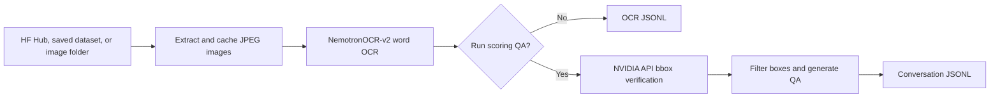

# Nemotron OCR Synthetic Data

The Nemotron OCR pipeline converts images into word-level OCR annotations and, optionally, scored visual question-answering conversations. It runs NemotronOCR-v2 locally on a GPU, can ask Nemotron-Nano-Omni through the NVIDIA Inference API to verify every bounding box, and writes one JSONL record per image.



<Info>
The merged API names are `OCRNemotronV2Stage`, `OCRScoringQAStage`, `HFDatasetImageReaderStage`, `JsonlSampleWriterStage`, `NVInferenceClient`, `OCRDenseItem`, `OCRData`, and `OCRConversationData`. Earlier development names such as `NemotronOCRV2Stage`, `OCRConversationalizeStage`, `OCRDenseQAStage`, `NVInferenceModel`, `OCRDenseWord`, `TarImageReader`, `SkipProcessedStage`, and `ResultWriterStage` are not shipped APIs. Conversation and dense-QA behavior is implemented by helper functions called inside `OCRScoringQAStage`.
</Info>

## Runtime architecture

| Component | Runs where | Resources and defaults | Responsibility |
| --- | --- | --- | --- |
| `HFDatasetImageReaderStage` | Driver/fan-out stage | 1 CPU | Loads a Hugging Face dataset, deduplicates image IDs, caches RGB JPEGs, and creates `ImageSampleTask[OCRData]` tasks. |
| `OCRNemotronV2Stage` | Curator worker | 8 CPUs, 1 GPU, stage batch size 32 | Loads NemotronOCR-v2 and adds normalized word boxes and text. Each image error is isolated. |
| `OCRScoringQAStage` | Curator worker plus NVIDIA API | 1 CPU, stage batch size 16 | Sends the image and OCR boxes to a remote verifier, applies quality thresholds, and creates a deterministic conversation. |
| `JsonlSampleWriterStage` | Curator worker | 2 CPUs | Appends records to worker-specific JSONL shards. |
| `merge_output_shards` | Driver | CPU and shared filesystem | Concatenates shards into the requested JSONL and deletes shards after a successful merge. |

The included runner starts a Ray cluster and uses `XennaExecutor`; it does not expose a Ray Data backend option. All workers must see the extracted image directory and output path through the same filesystem.

## Installation and model access

Use the NeMo Curator container for this pipeline. In addition to CUDA and the normal SDG/image dependencies, the repository Dockerfile builds the `nemotron-ocr` C++/CUDA extension from the `nvidia/nemotron-ocr-v2` repository. Installing `sdg_cuda12` or `image_cuda12` alone does not install that extension.

```bash
docker pull nvcr.io/nvidia/nemo-curator:{{ container_version }}

docker run --gpus all -it --rm \
  -v "$PWD:/workspace" \
  -w /workspace \
  nvcr.io/nvidia/nemo-curator:{{ container_version }}
```

Inside the container:

```bash
source /opt/venv/env.sh
python -c "from nemotron_ocr.inference.pipeline_v2 import NemotronOCRV2; print('Nemotron OCR ready')"
```

The default OCR stage downloads `nvidia/nemotron-ocr-v2` from Hugging Face and uses its `v2_multilingual` subdirectory. Mount a persistent Hugging Face cache, or pass a pre-downloaded `v2_multilingual` directory with `--nemotron-model-dir`.

The repository Dockerfile compiles for CUDA architectures 8.0, 8.6, 8.9, and 9.0. GPU memory requirements depend on image size, model version, and worker concurrency; the stage does not enforce a VRAM minimum.

The optional verifier reads `NVINFERENCE_API_KEY` from each worker's environment during setup. Do not place the key in source, CLI arguments, or serialized stage configuration. Obtain a key from [NVIDIA Build](https://build.nvidia.com/settings/api-keys) and ensure Ray workers inherit it.

## Input sources

`HFDatasetImageReaderStage` supports three source forms:

| Source | Detection and loading behavior |
| --- | --- |
| Hugging Face Hub dataset | A non-local dataset name is passed to `load_dataset`, with optional config and split. A limit becomes a split slice such as `train[:100]`. |
| Dataset saved to disk | An existing directory containing `dataset_info.json` is loaded with `load_from_disk`. If it yields a dataset dictionary, the requested split must exist. |
| Local image folder | Any other existing directory is loaded through the Hugging Face `imagefolder` builder. |

The image column may contain a PIL image, raw bytes, a Hugging Face Image dictionary with `bytes` or `path`, or a valid file-path string. Images are converted to RGB and saved as `<image_dir>/<image_id>.jpg`.

If `id_column` is unset, zero-padded row indexes are used. If set, only the first row for each ID is processed. IDs must be safe as local filenames. Hub and image-folder limits apply before ID deduplication, so the final number of unique tasks can be lower than the limit.

<Warning>
The current OCR pipeline has no tar reader, parquet reader, or skip-processed stage. To use those sources, implement an upstream stage that emits `ImageSampleTask[OCRData]`. Built-in resume behavior is limited to reusing already-extracted JPEG files.
</Warning>

## OCR data model

`OCRData` extends `ImageTaskData` and carries the reader, OCR, and verifier fields. When `OCRScoringQAStage` runs, it converts the payload to `OCRConversationData`, an `OCRData` subclass that adds the `conversation` field while retaining the base fields:

| Field | Producer | Meaning |
| --- | --- | --- |
| `image_path`, `image_id` | Reader | Cached JPEG and its dataset ID. |
| `is_valid`, `error` | All stages | Internal validity and last error. The writer removes `is_valid` from JSONL. |
| `ocr_is_word_level` | OCR/verifier | Defaults true; changes to false when the verifier identifies line boxes. |
| `ocr_dense` | OCR | `OCRDenseItem` values on a normalized 0–1000 grid. |
| `ocr_scoring_*` | Scoring QA | Prompt, model, raw response, mode, and missing-region audit data. |
| `conversation` | `OCRConversationData` from Scoring QA | Alternating user/assistant messages, with the image on the first user turn. This field is not part of the base `OCRData` dataclass. |

Each `OCRDenseItem` contains `bbox_2d`, `text_content`, optional `quad`, `valid`, `bbox_match`, and `text_errors`. Nemotron output is scaled to integer 0–1000 coordinates, and inverted vertical bounds are sorted.

<Warning>
Stored OCR boxes use `[x0, y0, x1, y1]`. The verifier prompt and `ocr_scoring_missing` use `[y0, x0, y1, x1]` to match its protocol. Reorder coordinates before combining these fields.
</Warning>

## Bounding-box verification

`OCRScoringQAStage` makes one remote verifier request per image:

| Setting | Default | Behavior |
| --- | --- | --- |
| `model_id` | `nvidia/nemotron-3-nano-omni-30b-a3b-reasoning` | NVIDIA Inference API model. |
| `temperature` | `1.0` | Verifier sampling temperature. |
| `max_tokens` | `16384` | Allows reasoning plus final JSON; only streamed final content is retained. |
| `min_bbox_match` | `5` | Inclusive minimum score for a valid box. |
| `max_text_errors` | `0` | Inclusive maximum error count. |
| `fail_on_missing_text` | `false` | Optionally invalidate the image when text regions are missing. |
| `dense_dump_prob` | `0.05` | Dense single-turn probability when no text is missing. |
| `batch_size` | `16` | Image tasks passed to the model stage. |
| `priority_mode` | `false` | Adds the NVIDIA priority header when enabled through Python. |

The verifier returns `ocr_mode`, indexed box scores, and `missing_text`. Missing or nonnumeric scores invalidate a box. If every original box is invalid, the image is invalid. Empty or unparseable responses also invalidate the image.

`NVInferenceClient` uses the NVIDIA integration endpoint, reads `NVINFERENCE_API_KEY`, streams final-answer content, allows 10 concurrent requests per worker, uses a 120-second timeout, and retries rate-limit and connection failures three times with exponential backoff and jitter.

## QA interaction shapes

The source defines five QA type constants. Four tag and balance the multi-turn families; the fifth, `dense_dump`, names the separate single-turn all-words path. Single-occurrence and repeated-text routing within the four tagged families produces six user-visible shapes:

| Shape | Prompt gives | Answer gives |
| --- | --- | --- |
| Box to text | One box | Text inside it |
| Point to text | One box center | Text at that point |
| Text to one box | Text occurring once | One box |
| Text to many boxes | Repeated text | Every matching box |
| Text to one point | Text occurring once | One center point |
| Text to many points | Repeated text | Every matching center point |

Generation is seeded from the framework task ID. At most 100 multi-turn QA pairs are balanced across the four tagged families. When five or more OCR items are invalid, text-to-location questions are disabled.

When no text is missing, `dense_dump_prob` can select a single turn listing every valid word. It combines one of 33 instruction phrasings with one of 11 answer formats:

| # | Dense answer format |
| --- | --- |
| 1 | Plain JSON list with `bbox_2d` and `text_content` |
| 2 | Fenced JSON code block |
| 3 | JSON with an explicit key-schema instruction |
| 4 | JSON with an explicit per-item object example |
| 5 | JSON-only response with no surrounding text |
| 6 | JSON with explicit `x_min, y_min, x_max, y_max` semantics |
| 7 | One `text [bbox]` item per line |
| 8 | One `[bbox]: text` item per line |
| 9 | One `text (x0, y0, x1, y1)` item per line |
| 10 | Markdown table |
| 11 | Tab-separated text and coordinates |

## Conversation schema

Within each output JSONL record, the top-level `conversation` field contains a wrapper object whose inner `conversation` field is the ordered turn list:

```json
{
  "conversation": {
    "conversation": [
      {"sender": "user", "fragments": [{"t": "image", "value": "000042.jpg"}, "What text is in the bounding box [120, 90, 440, 160]?"]},
      {"sender": "assistant", "fragments": ["PROJECT STATUS"]},
      {"sender": "user", "fragments": ["Point at the text 'TOTAL'. Answer with [x, y]."]},
      {"sender": "assistant", "fragments": ["[732, 518]"]}
    ]
  }
}
```

The image value is the cached filename, not its bytes. Use `--image-parent` to make `image_path` portable and distribute the cached images with the JSONL.

## Failure and restart model

- Cached JPEGs are reused by filename without verifying their content.
- OCR catches exceptions per image; prompt/response errors are also isolated per image. A generation or response-count failure can invalidate a whole scoring batch.
- Remote failures become empty responses after retries and invalidate the affected image.
- Worker JSONL records are flushed immediately. `valid_only=True` skips invalid tasks.
- The CLI defaults to `valid_only=False`, retaining invalid records and their `error` field.
- The writer removes `is_valid` and all `None` fields but retains empty lists, strings, and `false`.
- There is no processed-ID checkpoint. Reruns repeat OCR and API calls even when JPEGs are cached.
- Stale `*_worker*.jsonl` files are not cleaned before a run. Remove them or use a fresh output basename after interruption.

Continue with the [runnable tutorial](/curate-text/synthetic/nemotron-ocr/tutorial).

## Related topics

- [Synthetic data generation](/curate-text/synthetic)
- [LLM client configuration](/curate-text/synthetic/llm-client)
- [Image curation](/curate-images)
- [Execution backends](/reference/infra/execution-backends)
